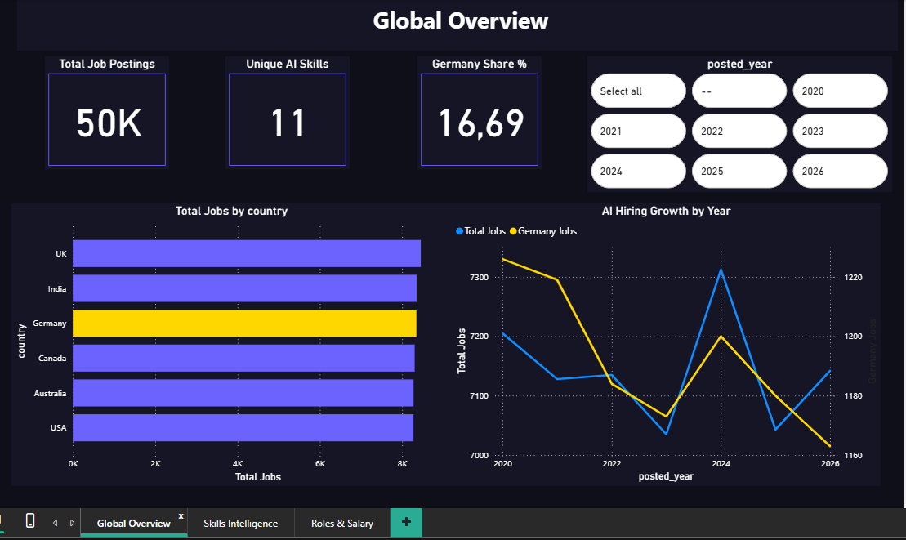
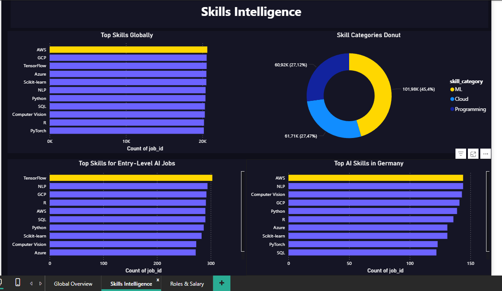
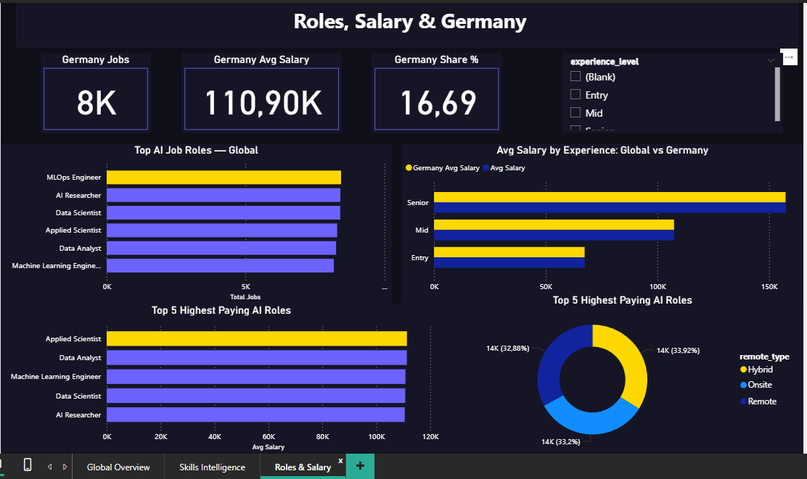

# AI Job Market Intelligence

An end-to-end data analytics case study on the global AI job market: hiring trends, in-demand skills, salary patterns, and how Germany compares with the global market.

## Business questions

- Which countries and years show the most AI hiring?
- Which skills are most in demand, globally, for entry-level roles, and in Germany?
- Which roles pay the most, and how does salary change with experience?
- How does Germany compare with the global market?

## Dashboard

Three-page Power BI report built on roughly 50,000 AI job postings (2020–2026).

### 1. Global Overview

### 2. Skills Intelligence

### 3. Roles, Salary & Germany

## Tools

- **Python (Google Colab)** for data cleaning and analysis
- **Power BI** for the dashboard and DAX measures
- **Google Sheets** for supporting data preparation

## Repository contents

| File | What it is |
|---|---|
| [Case_study_6_AI_Job_Market_Intelligence_08_06_26.ipynb](Case_study_6_AI_Job_Market_Intelligence_08_06_26.ipynb) | Python analysis notebook |
| [Case_study_6_S.o.w._AI Job Market Intelligence_09_06_26.pdf](<Case_study_6_S.o.w._AI Job Market Intelligence_09_06_26.pdf>) | Statement of work |
| [Case_study_6_Journal_Document_12_06_26.ipynb.pdf](Case_study_6_Journal_Document_12_06_26.ipynb.pdf) | Project journal and documentation |
| [assets/](assets) | Dashboard screenshots |

## Scope

Portfolio analysis on a public dataset. The findings describe the dataset, not the real hiring market.

---
**Author:** Vansh
